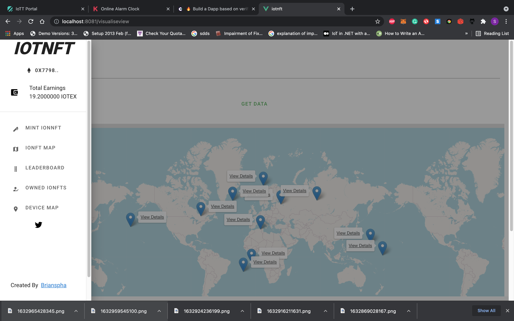
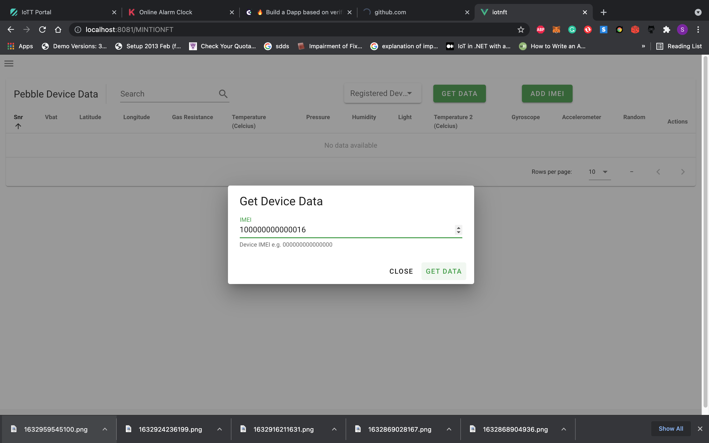
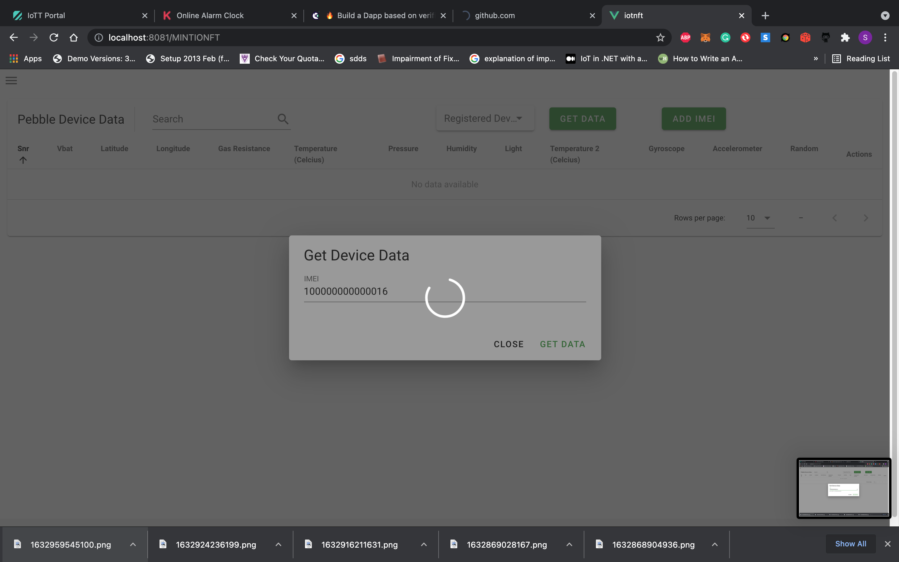
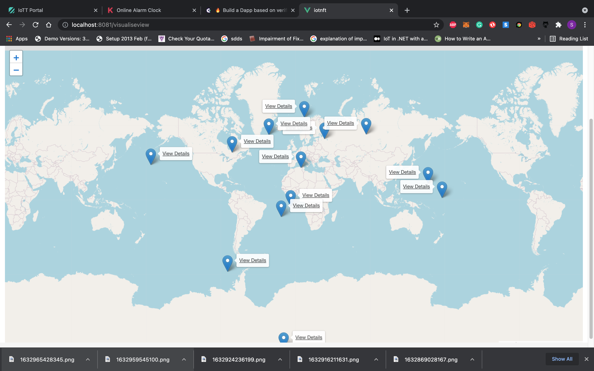
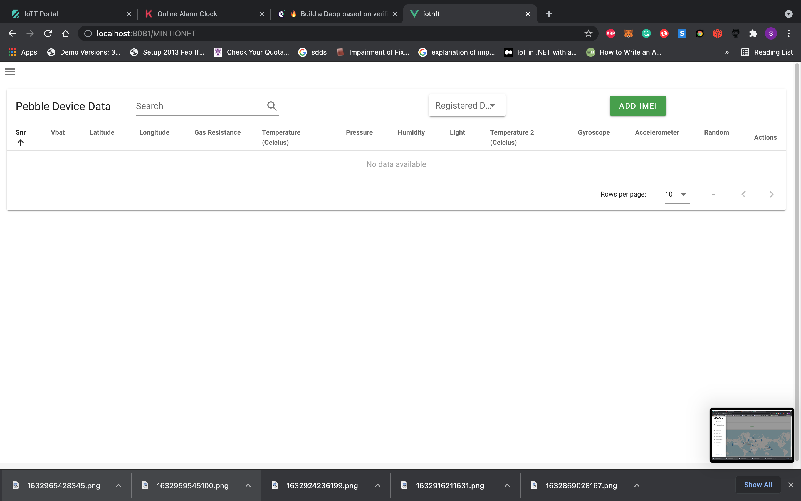
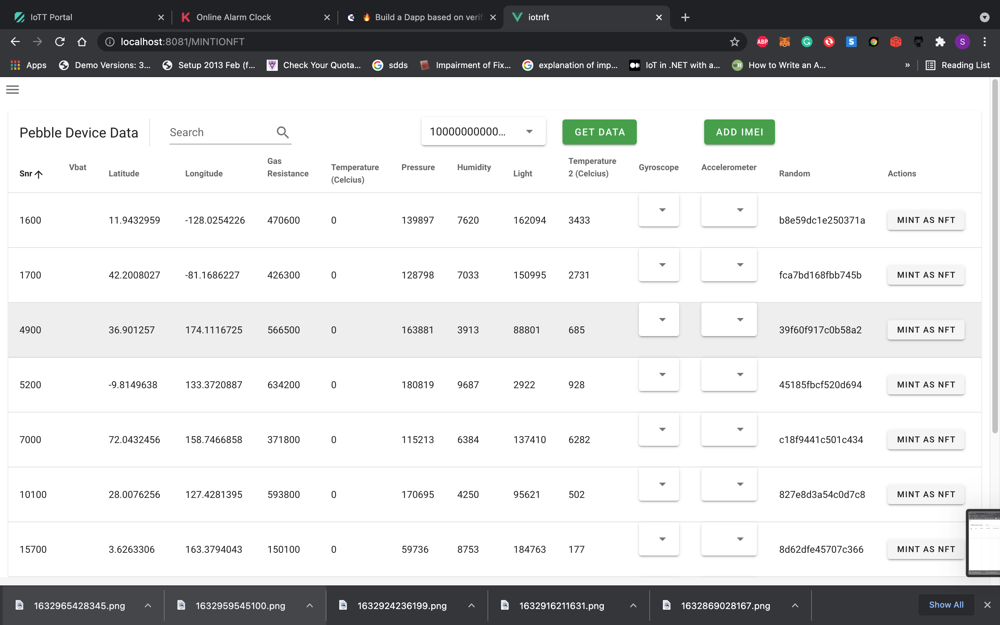
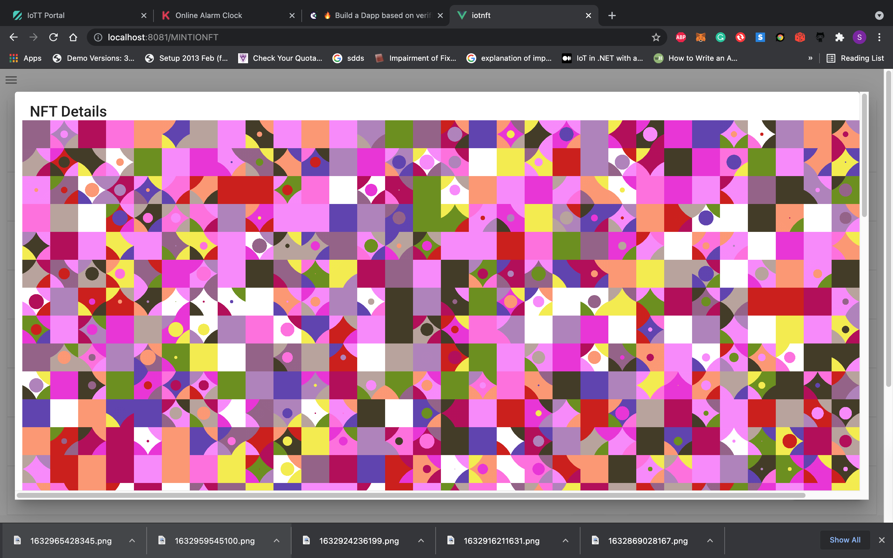
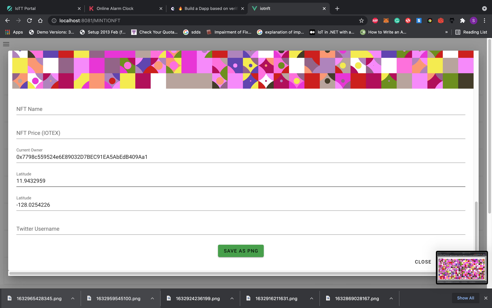
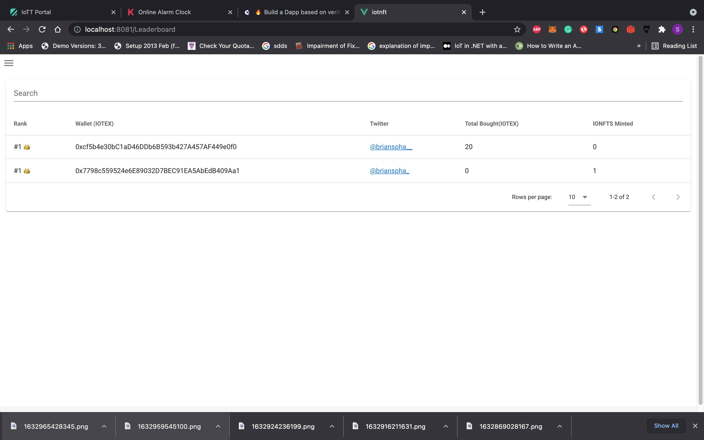

# iotnft
Generative NFT where the features are represented by actual device readings using Pebble Tracker IoT data

## Demo (Screenshots)

1. 
2. 
3. 
4. 
5. 
6. 
7. 
8. 
9. 


### Demo (video click on image to open)
<a href="https://siasky.net/EAD9mXZ5hWOPC9_bW3WPeLX4Y69BIbzlkODlJh1CLk2pDA
" title="video text"></a>


## Deployments (Contracts- IOTEX Testnet)

1. IOTNFT - https://testnest.iotexscan.io/address/0xF5C8fa7703951fD975E898a523d754353c5AbFB1
2. TokenContract -https://testnest.iotexscan.io/address/address/0x876B1e8ca12EF6454035Da8C0F3519766c621921

## Deployments (DApp)
1. https://brianspha.github.io/sky-painter/
### Customize configuration


## Project setup
```
yarn install
```

### Compiles and hot-reloads for development
```
yarn serve
```

### Compiles and minifies for production
```
yarn build
```

### Lints and fixes files
```
yarn lint
```

### Customize configuration
See [Configuration Reference](https://cli.vuejs.org/config/).
